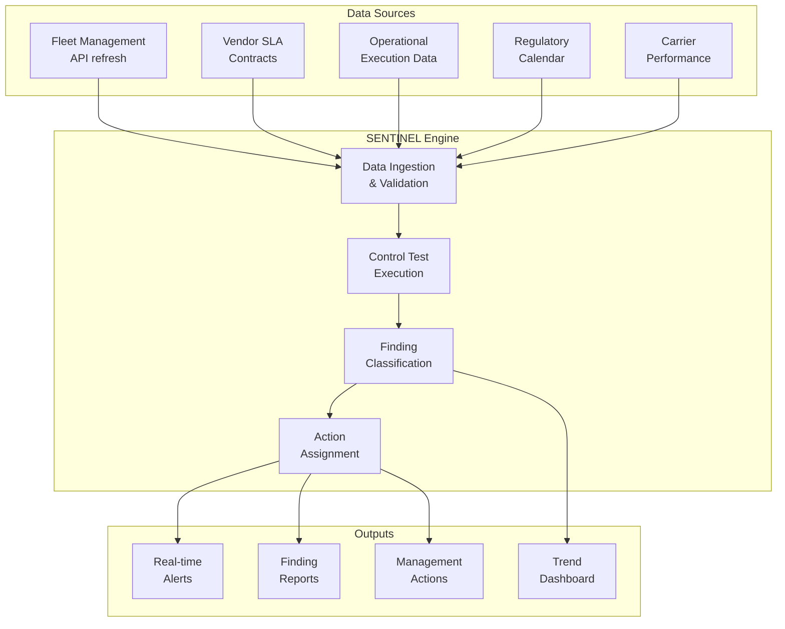

# SENTINEL — Automated Control Monitoring System

> Real-time detection of operational control failures across the EU network

---

## Overview

SENTINEL is a Python-based automated audit system that continuously monitors 50+ vendor relationships across 5 European markets. It replaces periodic manual sampling with real-time control testing, generating findings with severity classification and recommended corrective actions.

## Problem Statement

Traditional operational auditing relied on:
- Manual spot-checks (sampling 30 cases from thousands)
- Periodic reviews (weekly or monthly)
- Reactive investigation (finding problems after they caused damage)
- Single-analyst dependency (knowledge locked in one person)

This approach missed issues in real time, allowed problems to compound, and couldn't scale with the growing network.

## Solution Architecture



## Key Design Principles

### 1. Correlation-Based Detection
Unlike threshold-based systems that flag anything above/below a number, SENTINEL looks for causal relationships:
- Did a control fail? (truck cancelled, SLA breached, deadline missed)
- Were outcomes affected? (shipments delayed, costs incurred)
- Is there a verifiable link between the two?

### 2. Data Quality Gates
Before any control test runs, the system validates:
```python
def validate_data_freshness(data_source, max_age_hours=24):
    """Block execution if data is stale - prevents false findings."""
    if data_source.last_update < datetime.now() - timedelta(hours=max_age_hours):
        raise DataQualityError(
            f"Source '{data_source.name}' is {age_hours}h old. "
            f"Maximum allowed: {max_age_hours}h. Audit paused."
        )
```

### 3. Severity Classification

| Severity | Criteria | Response Time |
|----------|----------|---------------|
| HIGH | Financial impact > €10K OR regulatory exposure | Same day |
| MEDIUM | Operational disruption, SLA breach | Within 1 week |
| LOW | Process inefficiency, minor deviation | Within 1 month |

### 4. Structured Finding Output

Every detected issue generates a finding with:
- Unique ID for tracking
- Evidence (data references, timestamps, affected transactions)
- Root cause classification
- Recommended corrective action
- Assigned owner
- Deadline for resolution

## Control Tests Implemented

| Control Test | What It Checks | Frequency |
|-------------|----------------|-----------|
| Vendor SLA compliance | Actual vs contractual performance | Hourly |
| Capacity utilization | Truck fill rate vs minimum threshold | Per dispatch |
| Departure timing | Actual vs scheduled departure | Per truck |
| Arrival timing | Actual vs expected arrival (SLA) | Per truck |
| Cancellation impact | Whether cancelled capacity affected deliveries | Per event |
| Regulatory compliance | Driving hours, weekend bans, rest periods | Daily |
| Configuration validity | Lane/route configs match actual operations | Daily |

## Results

| Metric | Value |
|--------|-------|
| **Financial impact** | $104K in first operational week |
| **Interventions triggered** | 164 from 205 cases assessed |
| **Detection speed** | Real-time (hourly cycles) |
| **Coverage** | Full EU network (5 markets) |
| **False positive rate** | <5% (correlation-based, not threshold-based) |
| **Time saved** | 1.6 hours/day per analyst |
| **Adoption** | Accepted as company standard |

## Technology Stack

| Component | Technology |
|-----------|-----------|
| Core engine | Python 3 |
| Data processing | pandas, openpyxl |
| API integration | requests (fleet management API, batch querying) |
| Scheduling | Windows Task Scheduler + batch scripts |
| Output | Structured text reports, Excel dashboards |
| Data sources | REST APIs, tab-separated files, Excel |

## Lessons Learned

1. **Start with the control objective, not the data.** Define what "good" looks like before building detection logic.
2. **Correlation beats thresholds.** A truck departing 45 minutes late with zero impact is noise; a truck departing 15 minutes late that causes 50 missed deliveries is a finding.
3. **Data quality is a control itself.** If your source data is unreliable, your audit findings are unreliable. Gate the process.
4. **Automation enables, not replaces, judgment.** SENTINEL surfaces findings; humans validate, prioritize, and act.

---

*Built: September 2025 – Present*
*Status: Production (running daily)*
*Impact: $104K/week, 164 interventions, adopted as standard*
