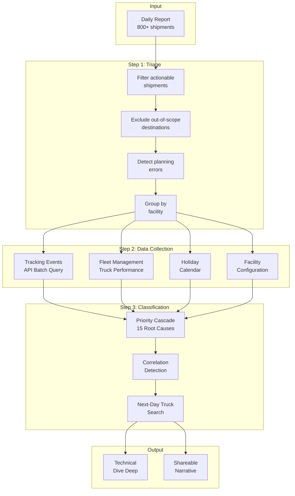

# Delivery Miss Root Cause Classification Engine

> Automated end-to-end audit of delivery misses across 10 data sources

---

## Overview

A Python-based automated root cause analysis engine that investigates why orders miss their promised delivery date. The system processes 800+ shipments daily, classifies each facility's root cause from 15 categories, and generates audit-ready narratives in 3 minutes (replacing a 60-minute manual process).

## Problem Statement

Every morning, an experienced analyst manually investigated delivery misses:
- Download report of ~800 late shipments
- Group by origin facility (120+ facilities)
- Export tracking data from an internal tool (copy-paste IDs, wait, download)
- Cross-reference truck execution data from a separate system
- Classify root cause per facility (15 categories)
- Write narrative summary for the daily report

**Issues**: Time-consuming (60 min), error-prone, single-person dependency, not scalable.

## Solution Architecture



## Root Cause Classification System

The engine uses a priority cascade, checking the most impactful causes first:

| Priority | Root Cause | Detection Logic | Data Source |
|----------|-----------|-----------------|-------------|
| 1 | Infeasible Plan | Estimated arrival > promised delivery date | Planning system |
| 2 | Late Preparation | Shipment prepared after scheduled ship date | Tracking API |
| 3 | Multi-package Split | ≥15% multi-package orders with mixed status | Tracking API |
| 4 | Lane Closure / Holiday | Facility closed on expected ship date | Calendar |
| 5 | Loading Delay | ANY truck departed >1h late + affected shipments | Fleet system |
| 6 | Truck Cancelled | ANY truck cancelled + affected shipments | Fleet system |
| 7 | Capacity Bid Not Secured | Open bid not executed + affected shipments | Fleet system |
| 8 | Carrier Delay | On-time departure, >1h late arrival | Fleet system |
| 9 | Carrier Availability (D+1) | ALL trucks cancelled + next-day trucks found | Fleet system |
| 10 | Sortation Delay | Trucks on time + shipments stuck at sort center | Fleet + Tracking |
| 11 | Late Shipping | Shipments not shipped, no truck issue found | Tracking API |
| 12 | Backlog | ≥30% shipments with ship date > 3 days old | Tracking API |
| 13 | Split | Both pending inbound and pending outbound coexist | Tracking API |
| 14 | Mixed Plan Issue | Mix of infeasible + feasible already in transit | Planning + Tracking |
| 15 | Needs Manual Review | Patterns inconclusive | Fallback |

## Key Design Decisions

### Correlation-Based Detection
```python
# NOT this (arbitrary threshold):
if pct_trucks_late > 0.5:  # "50% trucks late = truck issue"
    rc = "Carrier Delay"

# THIS (correlation-based):
if any_truck_late AND shipments_affected_by_late_truck:
    rc = "Carrier Delay"  # Causal link established
```

### Volume Counting
```python
# Count unique SHIPMENTS, not packages
volume = df['shipment_id'].nunique()
# A 3-box order is 1 shipment, not 3 problems
```

### Next-Day Truck Detection
When all trucks are cancelled on the expected ship date, the engine searches for next-day trucks:
```python
def find_next_day_trucks(lane, expected_ship_date, fleet_data):
    """
    Search fleet system for trucks on D+1 passing through the origin.
    Uses route sequence to detect multi-stop routes.
    Cross-references inbound timestamps to verify volume moved.
    """
    next_day = expected_ship_date + timedelta(days=1)
    candidates = fleet_data[
        (fleet_data['route_sequence'].str.contains(origin)) &
        (fleet_data['departure_date'] == next_day) &
        (fleet_data['status'] == 'COMPLETED')
    ]
    return verify_inbound_crossreference(candidates, shipment_inbound_times)
```

## Data Integration

| Source | Purpose | Refresh |
|--------|---------|---------|
| Daily delivery report | Late-shipment identification | Daily (morning) |
| Tracking Events API | Package-level scan events | Real-time (batch) |
| Fleet Management System | Truck schedules, departures, arrivals | Daily refresh (API) |
| Holiday Calendar | Public holidays per country | Static + annual update |
| Facility Configuration | Node types, scope classification | Monthly |
| Carrier SLAs | Expected transit times per lane | Quarterly |
| Lane Contracts | Active routes and scheduling | Monthly |
| Sortation Data | Sort center throughput and timing | Daily |
| Capacity Data | Dispatch windows and cut-off times | Daily |
| Historical Reports | Repeat offender tracking | Rolling 4 weeks |

## Results

| Metric | Value |
|--------|-------|
| **Classification accuracy** | 100% (validated vs experienced analyst) |
| **Time reduction** | 60 min → 3 min (95%) |
| **Facilities audited daily** | 124 |
| **Shipments processed daily** | 800+ |
| **Root cause categories** | 15 |
| **Data sources integrated** | 10 |
| **Manual intervention required** | 0% (fully automated) |
| **Running since** | May 2026 (production daily) |

## Validation Approach

Side-by-side comparison with the manual analyst across multiple days:
- Same facilities investigated
- Same data inputs provided
- Root cause classification compared line by line
- **Result: 100% match** on every facility tested

## Technology Stack

| Component | Technology |
|-----------|-----------|
| Core engine | Python 3 |
| Data processing | pandas, openpyxl, csv |
| API client | requests (batch queries, 500 IDs per call) |
| Token management | Selenium (Chrome), JWT extraction |
| Output | Structured text narratives, Excel reports |
| Scheduling | Batch script orchestration |

---

*Built: April – May 2026*
*Status: Production (running daily since May 2026)*
*Impact: 95% time reduction, 100% accuracy, zero manual dependency*
