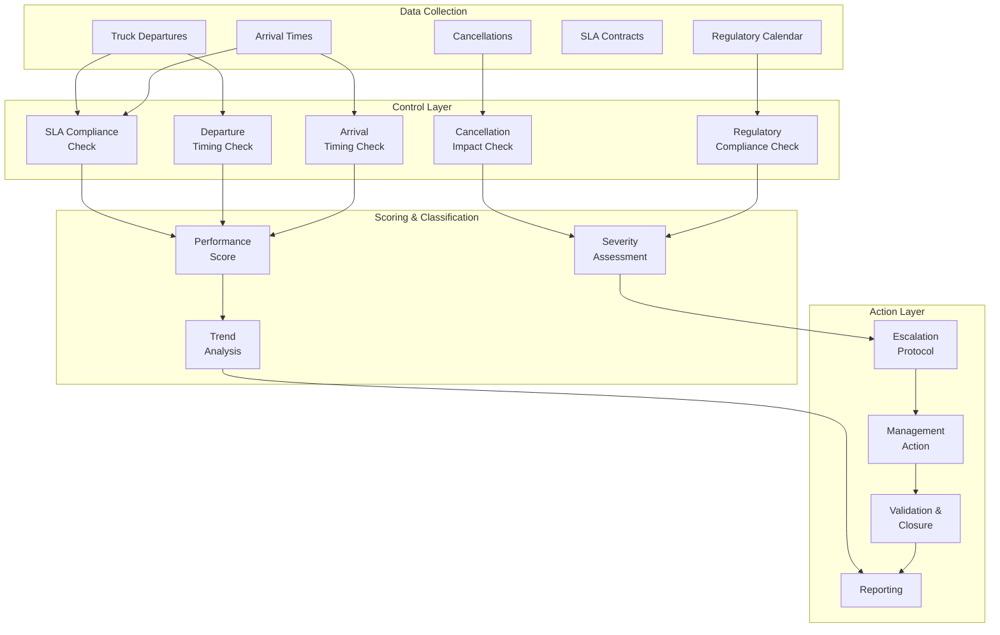
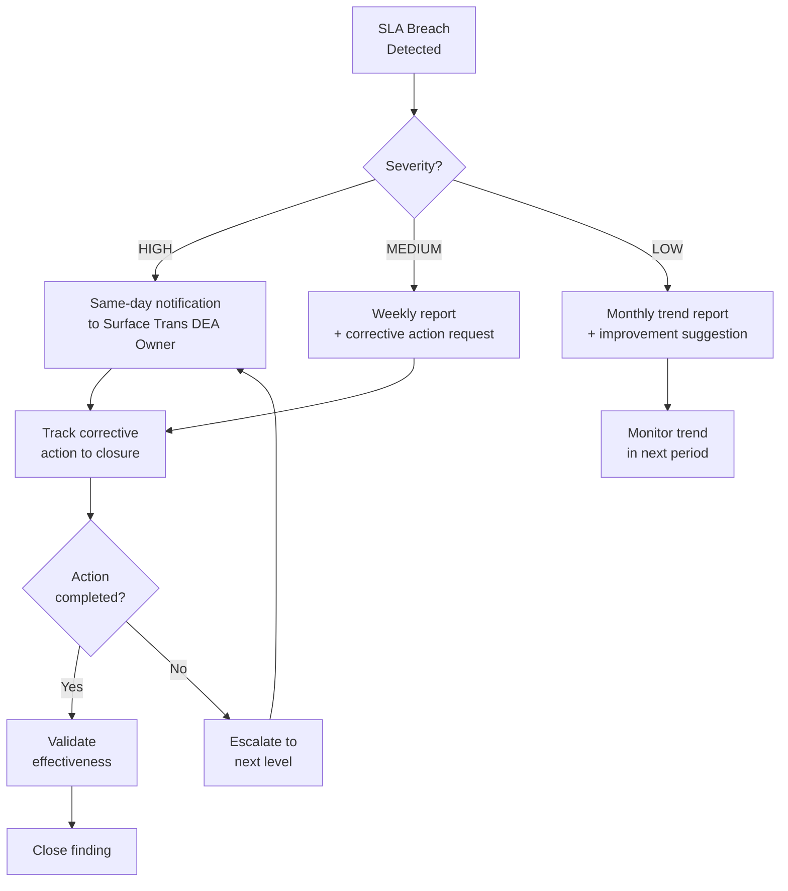

# Vendor Compliance Framework

> Automated SLA tracking, performance scoring, and escalation protocols for 50+ vendors

---

## Overview

A comprehensive control framework that monitors vendor performance across 5 European markets, automatically detects SLA breaches, scores vendor compliance, and triggers structured escalation protocols. Processes 1,700+ cases annually with automated classification and management action tracking.

## Problem Statement

With 50+ carrier/vendor relationships across 5 jurisdictions:
- Manual SLA tracking was inconsistent (different people, different criteria)
- Breaches were detected late (weekly reviews instead of real-time)
- No standardised escalation protocol (ad-hoc responses)
- No historical tracking of vendor performance trends
- Corrective actions were agreed but not systematically validated

## Framework Design

## SLA Control Tests

| Control | Threshold | Action if Breached |
|---------|-----------|-------------------|
| Departure delay | >1 hour from scheduled | Finding: Loading Delay |
| Arrival delay | >1 hour from expected | Finding: Carrier Delay |
| Cancellation without replacement | Sole truck for lane+CPT | Finding: Capacity Gap |
| Weekend/holiday compliance | Subject to driving bans | Finding: Regulatory Non-Compliance |
| Equipment type match | Contract specifies vehicle type | Finding: Configuration Error |

## Escalation Protocol

## DEA Owner Assignment Matrix

| Issue Location | DEA Owner | Escalation Contact |
|---------------|-----------|-------------------|
| In transport (carrier delay, traffic, driving ban) | Surface Transportation | Chelsea Jones |
| At destination (unloading, capacity, operational) | Last Mile | Giacomo Rabino |
| At origin (late sortation, scheduling) | ATS Sort Center | ATS leadership |
| Plan infeasible / wrong equipment type | ATS Controllable | Planning team |

## Performance Tracking

### Vendor Scorecard Metrics

| Metric | Weight | Measurement |
|--------|--------|-------------|
| On-time departure | 30% | % trucks departing within 1h of schedule |
| On-time arrival | 30% | % trucks arriving within SLA window |
| Cancellation rate | 20% | % planned trucks cancelled without replacement |
| Regulatory compliance | 20% | Zero-tolerance for driving ban violations |

### Monthly Trend Tracking

The framework generates monthly performance reports showing:
- Vendor-by-vendor scorecard
- Trend vs previous months (improving/degrading)
- Repeat findings (same vendor, same issue)
- Cost impact of non-compliance
- Corrective action completion rate

## Results

| Metric | Value |
|--------|-------|
| **Cases processed annually** | 1,700+ |
| **Vendors monitored** | 50+ |
| **SLA compliance rate** | 85.1% |
| **Markets covered** | 5 (DE, UK, FR, ES, IT) |
| **Cases processed (audit tool)** | 4,524 |
| **Adjustment accuracy** | 30.7% |
| **Cost avoidance generated** | €529,800 |
| **Escalation response time** | Same-day (HIGH severity) |

## Technology

| Component | Technology |
|-----------|-----------|
| Data collection | Python (FMC API client, batch processing) |
| SLA calculation | pandas (threshold comparison, gap analysis) |
| Reporting | openpyxl (multi-sheet Excel), structured text |
| Historical tracking | CSV audit log with deduplication |
| Scheduling | Daily automated refresh |

---

*Built: September 2025 – Present*
*Status: Production (daily monitoring)*
*Impact: €529K cost avoidance, 1,700+ cases/year, 85.1% SLA compliance*
