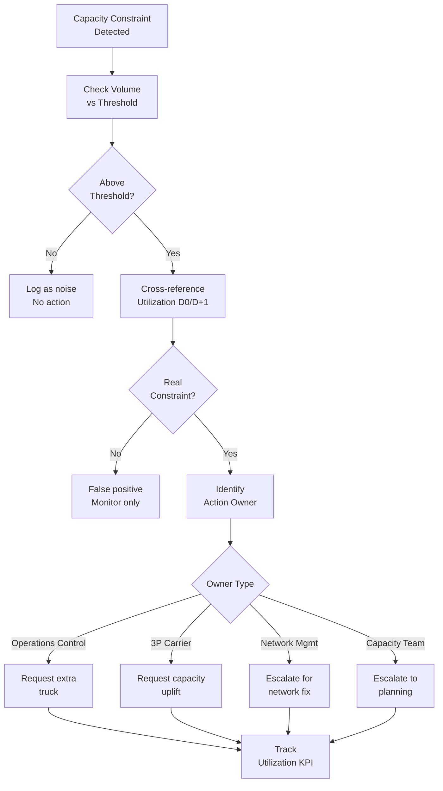
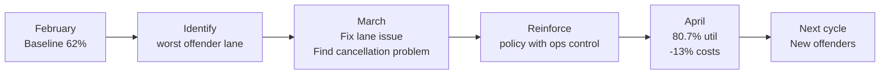

# Capacity Constraint Audit Process

> 4x daily audit cycle monitoring transportation capacity constraints across 15 buildings

---

## Overview

A structured audit process that monitors transportation capacity constraints in real time, identifies when capacity shortfalls threaten customer delivery promises, and triggers corrective actions. Operates 4 times daily across 15 fulfillment buildings in the EU network.

## Problem Statement

A capacity management system limits units from being picked when downstream transport capacity is insufficient. When constraints activate, fulfillment centers cannot complete their ship plans, directly impacting delivery promises.

The inherited process was:
- Incorrectly executed (wrong thresholds, inconsistent methodology)
- Not standardised (different people, different decisions)
- No feedback loop (truck requests were never validated for effectiveness)
- No KPI tracking (no way to measure if the process was working)

## Process Design

### Audit Cycle (4x Daily)

```mermaid
gantt
    title Daily Capacity Audit Schedule
    dateFormat HH:mm
    axisFormat %H:%M

    section Audits
    Audit 1 (Morning)      :08:00, 60min
    Audit 2 (Midday)       :13:00, 60min
    Audit 3 (Evening)      :18:00, 60min
    Audit 4 (Night)        :20:30, 60min
```

### Decision Framework

### Threshold Framework

| Capacity Type | Unit Threshold | Hours-to-Cutoff |
|---|---|---|
| Linehaul In-border | 70 units | 6 hours |
| 3P Carrier (XL) | 40 units | 12 hours |
| Middle Mile 3P (XL) | 40 units | 24 hours |
| Middle Mile 3P (Standard) | 40 units | 24 hours |
| Linehaul Cross-border | 110 units | 6 hours |
| Sort Center | 40 units | 6 hours |
| Delivery Station (large) | 40 units | 24 hours |
| Delivery Station (standard) | 40 units | 24 hours |

## KPI: Truck Utilization

The core audit quality metric: "When we request an extra truck because of capacity constraints, does the volume actually materialize?"

### Performance Trend

| Metric | Feb 2026 | Mar 2026 | Apr 2026 | Trend |
|--------|----------|----------|----------|-------|
| Trucks Granted | 65 | 75 | 76 | +17% |
| Avg Utilization | ~62% | 65.7% | **80.7%** | +18.7pp |
| Cancellation Rate | 23.1% | 34.7% | **26.3%** | Improved |
| Cancellation Cost | N/A | €3,020 | **€2,620** | -13.3% |
| Trucks >75% Util | ~25 | ~21 | **32** | +28% |

### Improvement Cycle

**Measure → Identify → Act → Improve → Repeat**

## Reporting Structure

Each audit produces a standardised report:
1. **Constraint Snapshot**: Current constraints by building with action status
2. **Ship Plan + Backlog Cross-view**: Context for constraint significance
3. **Results Section**: Resolution tracking from previous audit
4. **New Flag Identification**: First-time constraints requiring attention

## Results

| Metric | Value |
|--------|-------|
| **Utilization improvement** | 62% → 80.7% (+18.7 percentage points) |
| **Cancellation cost reduction** | -13.3% (€3,020 → €2,620) |
| **Audit frequency** | 4x daily (Mon-Fri) |
| **Buildings covered** | 15 |
| **Sustained operations** | Nov 2025 → Present (7+ months) |
| **Trucks >75% utilization** | +28% (25 → 32) |

## Key Lessons

1. **Establishing the KPI was the breakthrough.** Without measuring utilization, we couldn't improve it.
2. **Root cause of underperformance matters more than the symptom.** Operations control was cancelling capacity trucks because the system didn't flag them as justified.
3. **Continuous improvement requires systematic monthly review**, not ad-hoc responses.
4. **Standardised thresholds enable any team member to execute consistently**, removing single-person dependency.

---

*Built: July 2025 – Present*
*Status: Production (4x daily, Monday–Friday)*
*Impact: +18.7pp utilization, -13.3% cancellation costs, 15 buildings covered*
