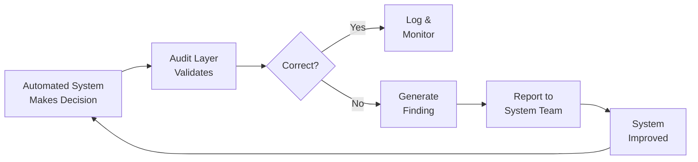
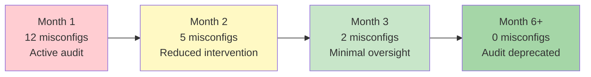

# Manual-to-Automated Transition Quality Assurance

> Validating automated system decisions during 7-week manual-to-automation transition

---

## Overview

Quality assurance framework built to validate an automated capacity management system during its transition from manual execution. The audit layer ensured zero disruption while the system took over, caught 12 misconfigurations in the first month, and created a feedback loop that improved the system until it reached full maturity.

## Context

A capacity alignment process ensured the EU transportation network had enough truck capacity. When lane utilization exceeded 85%, additional trucks were requested.

**Before transition:**
- Manual execution by the operations team (2x daily)
- Limited to working hours (no overnight/weekend coverage)
- 7,776 trucks secured during 2023-2024
- 840,000 packages protected
- ~€20M in cost avoidance

**Target state:** Automated system operating 24/7 with 6 executions daily.

## QA Approach

### Gradual Transition with Audit Overlay

```mermaid
gantt
    title 7-Week Transition Plan
    dateFormat YYYY-W
    axisFormat Week %W

    section Control Level
    Full manual control                :w1, 2025-W01, 2w
    Automated + manual validation      :w3, after w1, 2w
    Automated + audit layer            :w5, after w3, 2w
    Full handover + audit active       :w7, after w5, 1w
```

| Week | Who Executes | Who Validates | Intervention |
|------|-------------|---------------|-------------|
| 1-2 | Manual (team) | N/A | Full control |
| 3-4 | Automated system | Manual (daily comparison) | Override if wrong |
| 5-6 | Automated system | Audit layer (automated) | Intervene on edge cases only |
| 7 | Automated system | Audit layer (automated) | No intervention needed |

### Audit Validation Tests

| Validation | What It Checks | Pass Criteria |
|-----------|----------------|---------------|
| Volume Signal Test | Did the forecast justify the truck request? | Forecast > threshold at time of request |
| Pending Bid Check | Were there open bids already seeking capacity? | No duplicate capacity requests |
| Rejected Truck Recovery | Were rejected trucks recovered before requesting new? | Recovery process exhausted first |
| Execution vs Cancellation | Were granted trucks actually running? | Execution rate > 60% |
| Volume Utilization | Did trucks carry sufficient volume? | Avg CBM > 18 per truck |

### Feedback Loop



## Results

| Metric | Target | Actual |
|--------|--------|--------|
| Transition disruption | Zero | **Zero** |
| Execution rate | >60% | **>65%** |
| Avg CBM per truck | >18 | **~21** |
| Response time | <48h | **Majority 24-48h** |
| Coverage | 24/7 | **6x daily (every 4h)** |
| Misconfigurations caught | N/A | **12 in first month** |

### System Maturity Progression



By September 2025, the system reached full maturity. The audit was deprecated as it consistently made correct decisions without oversight. **This was the intended outcome:** build guardrails, improve the system until it no longer needs them, then step back.

## Historical Impact (Full Process)

| Metric | Value |
|--------|-------|
| Trucks secured | 7,776 |
| Packages protected | 840,000 |
| Cost avoidance | ~€20M |
| Coverage improvement | 2x → 6x daily |
| Final system maturity | Fully autonomous (no audit needed) |

## Key Lessons

1. **Never hand off to automation without a validation layer.** Trust but verify.
2. **Gradual transitions preserve business continuity.** Big-bang switches are risky.
3. **The goal is to make yourself unnecessary.** A successful QA program ends when the system works on its own.
4. **Feedback loops accelerate maturity.** Without audit findings feeding back to the system team, improvement would be 3x slower.
5. **Define success criteria upfront.** "When can we stop auditing?" should be answered before you start.

---

*Built: January 2025 (7-week transition)*
*Status: Completed (audit deprecated September 2025, system fully autonomous)*
*Impact: Zero-disruption transition, 12 misconfigs caught, €20M process protected*
