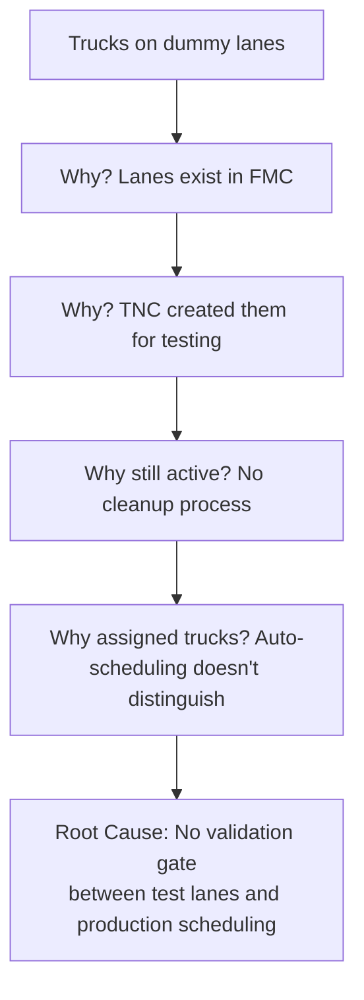

# Dummy Lanes Investigation

> Identifying hidden operational costs that surface-level analysis missed

---

## Overview

An investigative audit that uncovered 205 real trucks running on virtual (dummy) lanes that shouldn't exist, generating unnecessary cancellation costs. Initial assessments by others underestimated the scope. Deep data analysis revealed the true extent, and systematic corrective actions saved €30,448 while reducing the penalty cancellation rate from 30% to 12.1%.

## Situation

Virtual vehicles (dummy lanes) existed in the logistics system for technical reasons, but real trucks were being incorrectly assigned to them. This created:
- Confusion in operational reporting
- Unnecessary cancellation costs (trucks cancelled on invalid lanes incur penalties)
- Hidden cost exposure that wasn't visible in standard metrics

Initial assessments by others estimated the problem was small (handful of trucks). **I suspected otherwise.**

## Investigation Approach

### Phase 1: Hypothesis Challenge

I challenged the surface-level analysis. Instead of accepting the initial estimate, I:
- Queried the full FMC dataset across multiple lanes
- Identified patterns across XDEV→SDEV, XDEA→CDE9, XGEB→CGE9
- Found 205 real trucks on dummy lanes (not "a handful")

### Phase 2: Root Cause Analysis (5-Whys)

### Phase 3: Impact Quantification

| Lane | Trucks Found | Cancellation Exposure |
|------|-------------|---------------------|
| XDEV → SDEV | 78 | €13,728 |
| XDEA → CDE9 | 71 | €12,496 |
| XGEB → CGE9 | 56 | €9,856 |
| **Total** | **205** | **€36,080** |

### Phase 4: Corrective Actions

1. **Immediate**: Coordinated with ROC to cancel 205 trucks as "configuration error" (penalty-free)
2. **Short-term**: Worked with Xtra Mile to remove dummy lane assignments
3. **Preventive**: Escalated to TNC (Transportation Network Configuration) to implement validation gates
4. **Detective**: Built automated detection to catch future occurrences

## Results

| Metric | Before | After |
|--------|--------|-------|
| Trucks on invalid lanes | 205 | 0 |
| Penalty cancellation rate | 30% | 12.1% |
| Cancellations processed cost-free | N/A | 173 (87.8% success) |
| Savings | N/A | €30,448 |
| Avg savings per intervention | N/A | €176 |
| Preventive system | None | Automated detection |

## Finding Report

| Element | Detail |
|---------|--------|
| **Finding ID** | DL-2024-001 |
| **Severity** | HIGH (€30K+ financial exposure) |
| **Condition** | 205 real trucks assigned to virtual/dummy lanes |
| **Criteria** | Dummy lanes should have zero operational traffic |
| **Cause** | No validation gate between test configurations and production scheduling |
| **Effect** | €36K cancellation cost exposure, reporting confusion |
| **Evidence** | FMC query results across 3 lane pairs |
| **Management Action** | TNC to implement validation; Xtra Mile to clean assignments |
| **Status** | Closed (preventive system implemented) |

## Key Takeaways

1. **Challenge surface-level analysis.** "A handful of trucks" was actually 205. Always verify with data.
2. **Quantify the impact.** Without putting a euro figure on it, no one would have prioritised the fix.
3. **Fix the system, not just the symptom.** Removing 205 trucks was immediate relief; the validation gate prevents recurrence.
4. **Build detection for the future.** The automated system now catches dummy lane assignments before they become costly.

---

*Investigated: 2024-2025*
*Status: Resolved (preventive system in place)*
*Impact: €30,448 savings, penalty rate 30% → 12.1%, TNC process improvement*
