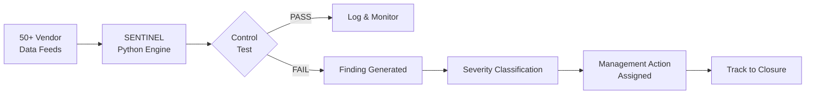
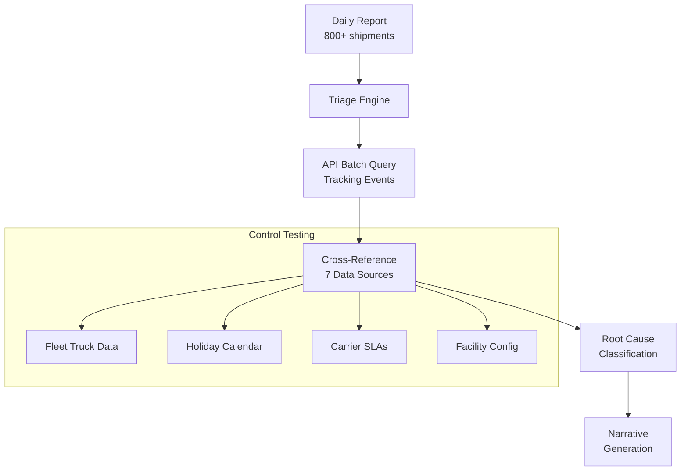
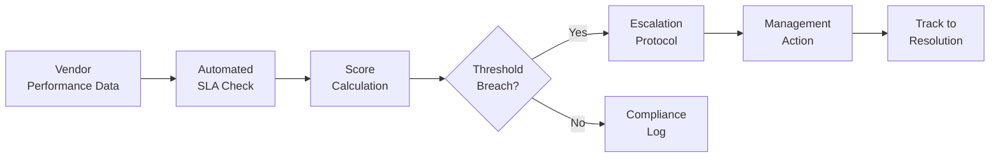
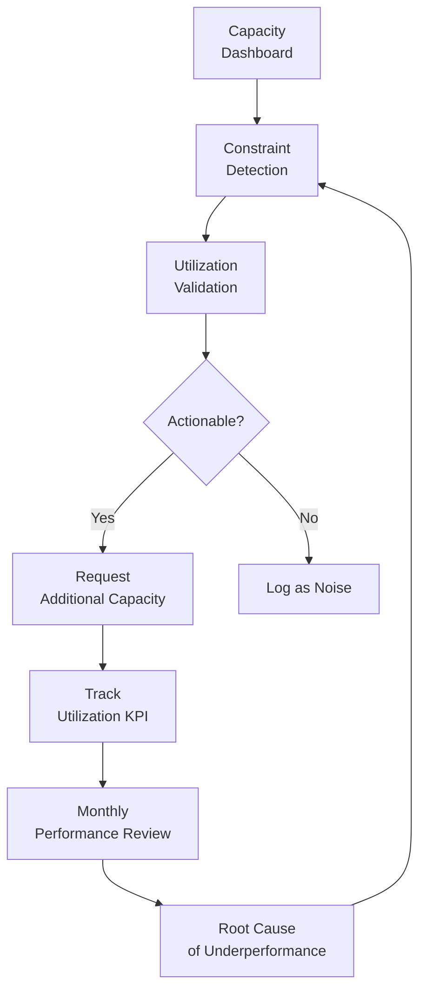
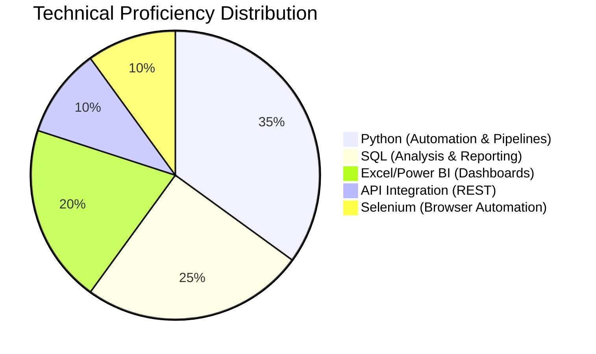
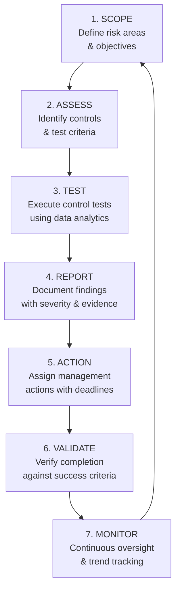
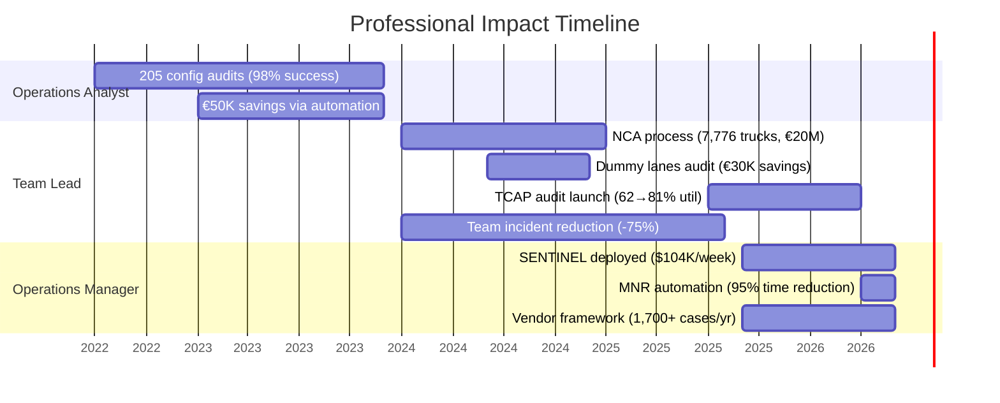

# Jose Jimenez Marin — Operations Audit & Controls Portfolio

<div align="center">


**Industrial Engineer | Operations Auditor & Controls Specialist**

Barcelona, Spain · [LinkedIn](https://www.linkedin.com/in/josebladimirjimenezmarin/) · bladi.jm@gmail.com

</div>

---

## About Me

Operations professional with **5+ years** of experience executing end-to-end audits, designing control frameworks, and driving compliance across Amazon's regulated European network. I combine deep audit methodology with strong data analytics skills to identify inefficiencies, test controls at scale, and deliver measurable business outcomes.

I build automated systems that replace manual sampling with continuous monitoring, enabling real-time control assurance across complex multi-market operations.

### Key Metrics

| Metric | Value |
|--------|-------|
| Markets audited | 5 (DE, UK, FR, ES, IT) |
| Annual cases processed | 1,700+ |
| Cost impact delivered | €710K+ |
| End-to-end audits (annual) | 200+ |
| SLA compliance tracked | 85.1% |
| Process time reduction | 95% (60 min → 3 min) |
| Team managed | 13 specialists |

---

## Portfolio Structure

```
├── 01-sentinel-automated-audit/       # Real-time control monitoring system
├── 02-mnr-root-cause-engine/          # Automated root cause classification
├── 03-vendor-compliance-framework/    # Vendor SLA tracking & scoring
├── 04-tcap-capacity-audit/            # Transportation capacity audit process
├── 05-nca-transition-qa/              # Automation QA & validation framework
├── 06-dummy-lanes-investigation/      # Hidden cost identification audit
└── docs/
    ├── METHODOLOGY.md                 # My audit methodology & approach
    ├── SKILLS_MATRIX.md               # Detailed competency breakdown
    └── CAREER_TIMELINE.md             # Professional journey & impact
```

---

## Featured Projects

### 1. SENTINEL — Automated Control Monitoring System
> Real-time detection of operational control failures across the EU network

[](/01-sentinel-automated-audit/)




| Metric | Result |
|--------|--------|
| Impact | **$104K in one week** |
| Interventions | 164 from 205 cases |
| Detection | Real-time (hourly cycles) |
| Coverage | Full EU network |

---

### 2. MNR Root Cause Classification Engine
> Automated end-to-end audit of delivery misses across 10 data sources

[](/02-mnr-root-cause-engine/)



| Metric | Result |
|--------|--------|
| Classification accuracy | **100%** (validated vs manual) |
| Time reduction | 60 min → 3 min (95%) |
| Facilities audited daily | 124 |
| Root cause categories | 15 |
| Data sources integrated | 10 |

---

### 3. Vendor Compliance Framework
> Automated SLA tracking, performance scoring, and escalation protocols

[](/03-vendor-compliance-framework/)



| Metric | Result |
|--------|--------|
| Cases processed | 4,524 |
| Vendors monitored | 50+ |
| SLA compliance rate | 85.1% |
| Jurisdictions covered | 5 EU markets |

---

### 4. TCAP Capacity Audit Process
> 4x daily audit cycle monitoring transportation capacity constraints

[](/04-tcap-capacity-audit/)



| Metric | Result |
|--------|--------|
| Utilization improvement | 62% → 80.7% (+18.7pp) |
| Cancellation cost reduction | -13.3% |
| Audit frequency | 4x daily |
| Buildings covered | 15 |

---

### 5. NCA-to-STCM Transition Quality Assurance
> Validating automated system decisions during manual-to-auto transition

[](/05-nca-transition-qa/)

| Metric | Result |
|--------|--------|
| Transition period | 7 weeks, zero disruption |
| Misconfigurations caught | 12 in first month |
| Trucks secured (process total) | 7,776 |
| Cost avoidance | ~€20M |
| Coverage increase | 2x → 6x daily (24/7) |

---

### 6. Dummy Lanes Investigation
> Identifying hidden operational costs missed by surface-level analysis

[](/06-dummy-lanes-investigation/)

| Metric | Result |
|--------|--------|
| Trucks identified on invalid lanes | 205 |
| Cancellations processed cost-free | 173 (87.8%) |
| Savings | €30,448 |
| Penalty rate reduction | 30% → 12.1% |

---

## Technical Skills



### Python Capabilities
- **Data pipelines**: pandas, openpyxl, csv for multi-source data integration
- **API clients**: requests, batch querying, token management, retry logic
- **Automation**: End-to-end process automation replacing manual workflows
- **Control testing**: Automated validation scripts with threshold-based alerting
- **Reporting**: Structured output generation (Excel, text narratives, dashboards)

### SQL Capabilities
- Complex joins across multiple data sources
- Aggregation and window functions for trend analysis
- Performance optimization for large datasets
- Reporting queries for KPI dashboards

---

## Audit Methodology



**Core Principles:**
- Correlation-based detection (not arbitrary thresholds)
- Data-driven findings backed by quantitative evidence
- Structured escalation protocols with clear ownership
- Continuous improvement loop: findings feed system improvements
- Independence and objectivity in all assessments

[Read full methodology →](/docs/METHODOLOGY.md)

---

## Career Impact Timeline



---

## Performance Recognition

| Year | Rating | Description |
|------|--------|-------------|
| 2026 | **Exceeds High Bar** | Highest performance rating at Amazon |
| 2026 | **Role Model** | Highest Leadership Principles recognition tier |

---

## Education

| Degree | Institution | Year |
|--------|-------------|------|
| MSc Supply Chain Management | Polytechnic University of Catalonia (UPC) | 2022 |
| BSc Industrial Engineering (STEM) | National University of Engineering (UNI) | 2013 |

---

## Contact

- **Email**: bladi.jm@gmail.com
- **LinkedIn**: [josebladimirjimenezmarin](https://www.linkedin.com/in/josebladimirjimenezmarin/)
- **Location**: Barcelona, Spain
- **Languages**: Spanish (Native) | English (C1 Professional)

---

<div align="center">
<i>This portfolio demonstrates real operational audit work performed at Amazon (2022-2026). Code samples are representative implementations showing methodology and approach — proprietary data and internal systems have been abstracted.</i>
</div>
