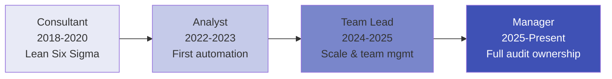

# Career Timeline & Impact

## Professional Journey

A progression from process improvement consulting through operational analysis to full audit and controls ownership across Amazon's European network.

---

## Timeline

### 2018–2020 | Process Improvement Consultant — OSTUMA (Remote, Spain)

**Foundation**: Built core competencies in Lean Six Sigma, process auditing, and structured improvement delivery.

- Conducted process audits for multiple clients
- Achieved 25% cycle time reduction through systematic methodology
- Delivered €50K in annual savings per engagement
- Developed KPI systems and compliance dashboards
- Documented findings using structured templates

**Skills developed**: Lean Six Sigma, DMAIC, process mapping, KPI design, stakeholder communication

---

### 2021–2022 | MSc Supply Chain Management — UPC Barcelona

**Academic foundation**: Formalised supply chain and operations knowledge at a top European engineering university.

- Supply chain strategy and network design
- Operations research and quantitative methods
- Procurement and supplier management
- Logistics and transportation management

---

### Jul 2022 – Dec 2023 | Transport & Logistics Operations Analyst — Amazon

**Entry into large-scale operations**: First exposure to operating at EU scale with millions of daily transactions.

**Key achievements:**
- Audited 205 critical network configurations with 98% success rate
- Built data-driven audit tools (Python, SQL) for automated control testing
- Generated €50K+ in savings through process automation
- Formalised audit procedures and documentation templates

**Impact**: Established credibility as someone who doesn't just execute, but improves and automates.

```
Audit volume:     ~50 configurations/quarter
Data sources:     3 (tracking, configuration, performance)
Automation:       First Python scripts for operational reporting
Savings:          €50K+
```

---

### Jan 2024 – Aug 2025 | Transport Operations Team Lead — Amazon

**Scaling up**: Took ownership of a 13-person team executing operational audits and compliance across 5 European markets.

**Key achievements:**

| Project | Impact |
|---------|--------|
| NCA truck capacity process | 7,776 trucks, €20M cost avoidance |
| STCM transition QA | 7-week zero-disruption transition, 12 misconfigs caught |
| Dummy lanes investigation | 205 trucks, €30K savings, penalty rate 30%→12% |
| Incident reduction | -75% (23.25 → 5.16 daily) |
| Process automation | 2h → 5min (99% reduction) |
| Carrier account management | 55+ changes during peak, 100% compliance |

**Impact**: Transformed a reactive team into a proactive audit function with measurable KPIs.

```
Team size:        13 specialists (5 countries)
Audit volume:     200+ end-to-end audits/year
Data sources:     7+ (fleet mgmt, tracking, config, carrier, calendar, capacity, compliance)
Automation:       Multiple Python tools in production
Total savings:    €20M+ cost avoidance (process lifetime)
```

---

### Sep 2025 – Present | Operations Manager — Amazon

**Full ownership**: Leading audit and controls function for the EU network with automated systems and real-time monitoring.

**Key achievements:**

| Project | Impact |
|---------|--------|
| SENTINEL (automated control system) | $104K/week, real-time detection |
| MNR root cause engine | 95% time reduction, 100% classification accuracy |
| Vendor compliance framework | 1,700+ cases/year, 85.1% SLA compliance |
| TCAP capacity audit | Utilization 62%→80.7%, -13.3% cancellation costs |
| Linehaul DD audit | Daily VRID audit with auto-classification |

**Impact**: Built an automated audit ecosystem that operates continuously across the EU network.

```
Markets:          5 (DE, UK, FR, ES, IT)
Annual cases:     1,700+
Data sources:     10+ integrated
Real-time:        Yes (SENTINEL, continuous monitoring)
Total savings:    €710K+ (current role)
Recognition:      "Exceeds High Bar" + "Role Model" (highest tiers)
```

---

## Cumulative Impact

```
Total career savings/avoidance:  €20M+ (lifetime) / €710K+ (current role)
Total audits executed:           500+ (career)
Markets covered:                 5 EU markets
Largest team managed:            13 people
Systems automated:               6 production tools
Recognition:                     Highest performance + highest LP rating (2026)
```

---

## Growth Trajectory



**Consistent pattern**: At every level, I've automated what I found, improved what I inherited, and left the process stronger than I received it.
